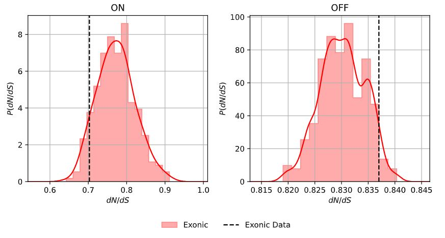

# Examples

In these examples, we run SOPRANO with SSB7. We will use the readily available
example annotated somatic mutation and bed protein input files shipped with
SOPRANO. These inputs are compatible with the GRCh37 reference genome. We will
seed the value of the simulations such that the outputs described on this page
can be reproduced on your own computer.

The main entry point for executing the soprano pipeline is `soprano-run`.

**Note:** If you have installed SOPRANO with the `mpi` or `dev` flavours, you
can prefix this with your appropriate MPI executable and processor count. For
example, `mpirun -n X`, `mpiexec -n X`, `srun -n X --pmix`, and so on; for
distribution over `X` processors.

***

## Example 1: dN/dS with analytic approximations to uncertainty

The most straightforward analysis involves running SOPRANO against a single
file, to compute dN/dS and estimate the statistical uncertainty via Katz
method.

In this case, one can execute `soprano-run @example_01.soprano`

```text title="example_01.soprano"
--input=/path/to/SOPRANO/data/example_annotations/TCGA-05-4396-01A-21D-1855-08.annotated
--bed_file=/path/to/SOPRANO/data/example_immunopeptidomes/TCGA-05-4396.Expressed.IEDBpeps.SB.epitope.bed
--name=TCGA-05-4396-example_01
--output=/tmp
--assembly=GRCh37
```

This will cache the results into the output directory
`/tmp/TCGA-05-4396-example_01`. There should only be a single sub-folder,
`data`. The results from this analysis are then inside the file
`/tmp/TCGA-05-4396-example_01/data/data.results.tsv`.

| Coverage        | ON_dnds             | ON_Low_CI            | ON_High_CI         | ON_Mutations | OFF_dNdS          | OFF_Low_CI          | OFF_High_CI        | OFF_Mutations | Pvalue              | ON_na | ON_NA     | ON_ns | ON_NS    | OFF_na | OFF_NA     | OFF_ns | OFF_NS    |
|-----------------|---------------------|----------------------|--------------------|--------------|-------------------|---------------------|--------------------|---------------|---------------------|-------|-----------|-------|----------|--------|------------|--------|-----------|
| Exonic_Only     | 0.17320730117340286 | 0.031724321858695226 | 0.9456709370621603 | 6.0          | 0.866868735958057 | 0.49699058713838856 | 1.5120234161945458 | 63.0          | 0.34485641679719375 | 2.0   | 1027780.0 | 4.0   | 356038.0 | 46.0   | 10627300.0 | 17.0   | 3404610.0 |
| Exonic_Intronic | 0.17320730117340286 | 0.031724321858695226 | 0.9456709370621603 | 6.0          | 0.866868735958057 | 0.49699058713838856 | 1.5120234161945458 | 63.0          | 0.34485641679719375 | 2.0   | 1027780.0 | 4.0   | 356038.0 | 46.0   | 10627300.0 | 17.0   | 3404610.0 |

## Example 2: dN/dS with numerical estimates of uncertainty

Alternative statistical measures on the significand of dN/dS can be obtained
via generating a suite of null hypothesis simulations from randomization of
the bed protein genomic background. In this case, we should specify some
number of samples to the SOPRANO definition file

In this case, one can execute `soprano-run @example_02.soprano`

```text title="example_01.soprano"
--input=/path/to/SOPRANO/data/example_annotations/TCGA-05-4396-01A-21D-1855-08.annotated
--bed_file=/path/to/SOPRANO/data/example_immunopeptidomes/TCGA-05-4396.Expressed.IEDBpeps.SB.epitope.bed
--name=TCGA-05-4396-example_02
--output=/tmp
--assembly=GRCh37
--seed=333
--n_samples=19
```

This will cache the results into the output directory
`/tmp/TCGA-05-4396-example_02`. There should be the same content as generated
in the previous example, in addition to a statistical summary file from
in addition to an automatically generated an accompanying `figure.pdf` file.

```text title="statistics.json"
# Placeholder
{
    "ON_dNdS": {
        "exonic_only": {
            "samples": {
                "mean_value": 0.7721069499148594,
                "std_dev": 0.04871517355356516
            },
            "data": {
                "value": 0.7028932965124453,
                "p_value_left": 0.08982714832397816,
                "p_value_right": 0.9101728516236403
            }
        }
    },
    "OFF_dNdS": {
        "exonic_only": {
            "samples": {
                "mean_value": 0.8301892065970186,
                "std_dev": 0.004196696763633817
            },
            "data": {
                "value": 0.837001816221436,
                "p_value_left": 0.9487837348903762,
                "p_value_right": 0.05121626510654794
            }
        }
    }
}
```


